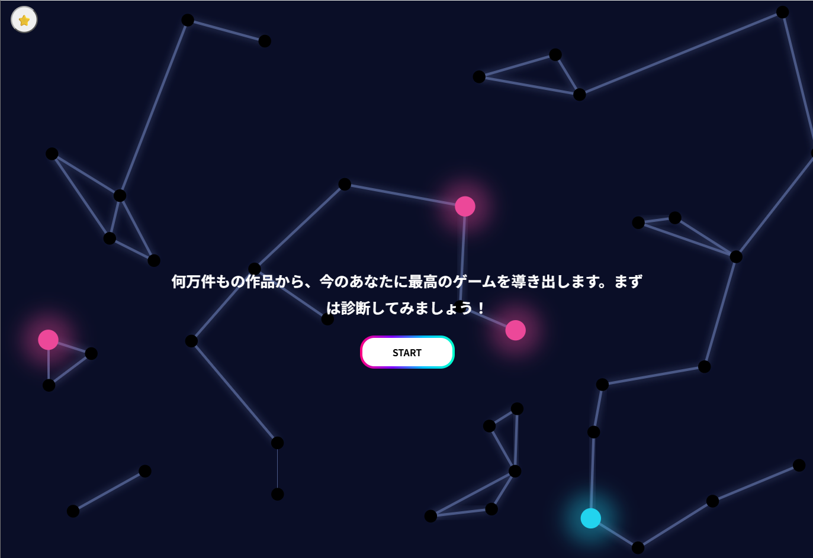
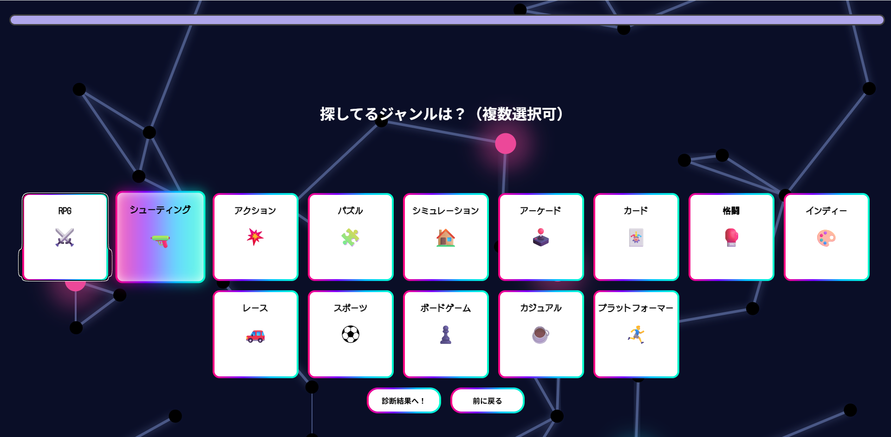
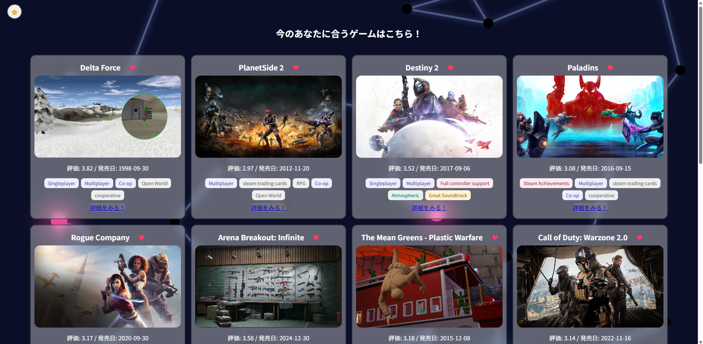

🎮 ゲームを手軽に検索できるツール（開発中）

ゲームが好きな人が手軽に診断から検索できるWebツールです。
6月からReactを独学しながら現在進行形で開発しています。

🌐アプリURL

https://game-search-app-taupe.vercel.app/

📱アプリの見た目(開発段階なので見た目に変更が入る場合があります。)

| スタート画面 | ジャンル選択 | 結果画面 |
|---|---|---|
|  |  | |

✨今できること（機能）
・ページの遷移機能（ボタン押下による画面の切り替え）
・ゲームの診断、ジャンル選択機能
・結果画面の表示
・ゲームのお気に入り登録機能(NEW‼️)

🛠️使っている技術
言語: TypeScript, JavaScript, CSS, HTML
フレームワーク/ライブラリ: React
開発環境: StackBlitz, vscode
使用API: RAWG Video Games Database API

🧠開発のこだわり
脱・コピペコード: AIツール(claude, gemini)をアドバイザーとして活用していますが、ただのコードをコピペするのではなく、意味を理解するためにも面倒でも都度タイピングしたり疑問は質問することを心がけています。
自走力の育成: 予期せぬエラーが出た際も、AIと対話しながら原因を突き止め、自分で解決する力を意識して開発しています。

🧑‍💻現在の開発状況について(8/27日更新)
ついにVercelのurlを対応させました！まだ開発途中なので粗もあるかもしれませんがこれからも機能のアップデートや見た目を整えていきますので、ぜひお時間がある時に軽く触っていただけたら嬉しいです！よろしくお願いします！

