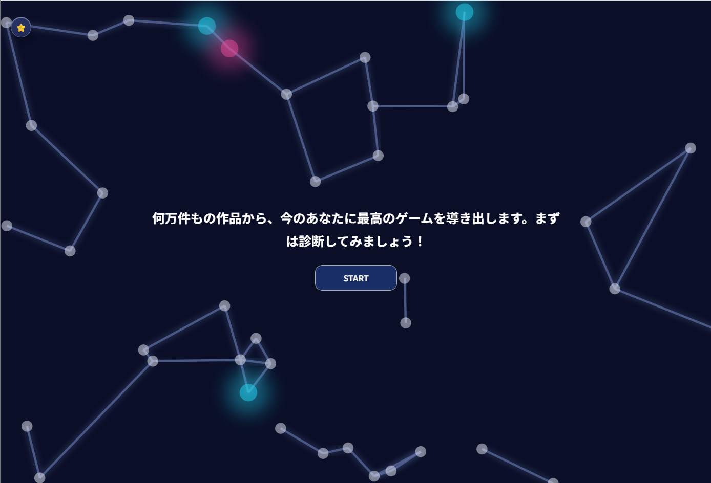
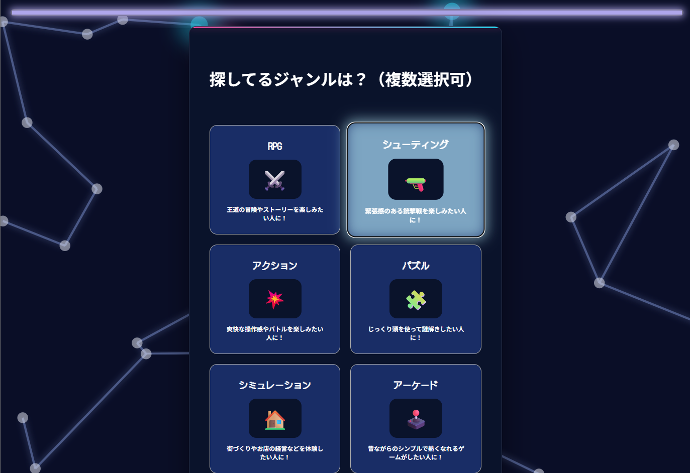
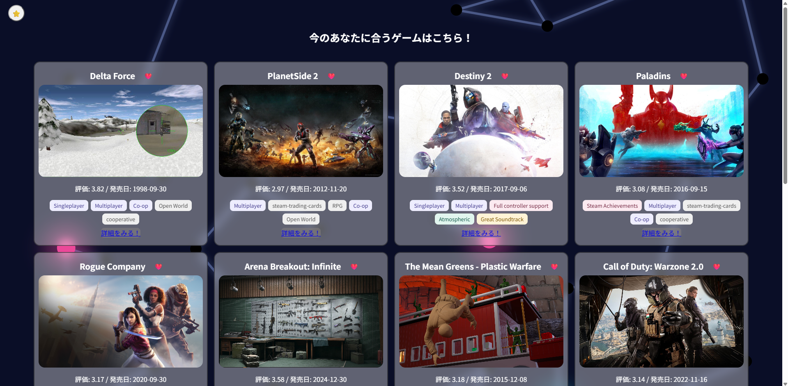

# 🎮 ゲームを手軽に検索できるツール（開発中）

ゲームが好きな人が手軽に診断から検索できるWebアプリケーションです。

6月からReactとTypeScriptを独学しながら、現在進行形で開発しています。

## 🤔 開発目的

ゲームが好きだけど、大規模すぎるサイトだとなかなか優柔不断で選べない！

といった個人の悩みから、同じような悩みを持つ人がこのアプリを使った時に
少しでもお気に入りのゲームを探せるようになったらいいなと考え、開発しました。

## 🌐 アプリURL (Vercel)

https://game-search-app-taupe.vercel.app/

## 📱 アプリの見た目

※ベータ版なので、見た目に変更が入る場合があります。

| スタート画面 | ジャンル選択 | 結果画面 |
|---|---|---|
|  |  |  |

## ✨ 今できること（ベータ版）

- ページの遷移機能（ボタン押下による画面の切り替え）
- ゲームの診断、ジャンル選択機能
- 結果画面の表示
- ゲームのお気に入り登録機能
- エラー時のモックデータ表示

## 🛠️ 使っている技術

- **言語**: TypeScript, JavaScript, CSS, HTML
- **フレームワーク/ライブラリ**: React
- **開発環境**: StackBlitz, VSCode
- **使用API**: [RAWG Video Games Database API](https://rawg.io/apidocs)

## 🧠 開発のこだわり

- **脱・コピペコード**
  AIツール(Claude, Gemini)をアドバイザーとして活用していますが、ただコードをコピペするのではなく、意味を理解するために、面倒でも都度タイピングしたり、疑問は質問することを心がけています。
- **自走力の育成**
  予期せぬエラーが出た際も、AIと対話しながら原因を突き止め、自分で解決する力を意識して開発しています。

## 🧑‍💻 現在の開発状況（10/07更新）

現在はベータ版としてデプロイ済みです。これからは次のことに取り組んでいきます。

- コードの整理やメモの整理
- 軽いデザインの修正
- 自分のコード理解をベースにした開発